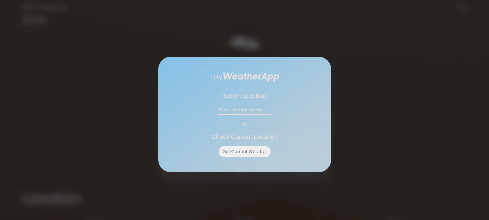

# myWeatherApp

"Weather Application providing lives updates"

**Version 1.0.0**

This is a minimalist style weather app which aims to provide live weather updates for the users current location or any location a user searches for. 

The app is fully responsive and will work for users on all screen sizes.

## Features

It also contains a couple of extra features:

- Next five hour forecast.
- Next five day forecast.
- Current weather for 10 different cities from around the world.

## How to use

To use myWeather app just follow the link below and type in a location to see the weather for that location and then press enter or click on the get current weather button to get the weather for your current location.

To use the next five day forecast, next five hours forecast and the major cities just click on one of the three buttons below.

## Technologies used

This Project is built using **Html**, **Scss** and **javascript**.
I also used npm in order to install and use **parcel** as my bundler to compile the files for the final version. **Core.js** and **regenerator** were also used in order to polyfill the code and to make sure all modern javascript features are backwards compatiable. **Git** was used to create the repository and link to gitHub and was constantly updated thoughout the projects development. It's also being used for the live intergration between the repository and the live deployed version on netlify.

## What i learned

My main takeaway from this project is using the **MVC** (Model, View, Controller) design pattern and it's based on the concept of having 
seperate modules for different tasks. The model fetches and handles the data for the app, the View modules
handle the Visual side of things and the controller module which handles the interaction between
the model and the view modules and also controls the behaviour and flow of the app overall.

This is my first project incorporating the MVC design pattern.
This made me think a lot more about the structure of the code more and about the data flow used in it.
I definitly think using a design pattern like this helped create a lot more structure to the code and
make it easier overall to read and follow by spliting the code up into designated sections. 
It also helped when it came to using classes by creating reusable methods that can be reused in different
places in the project, which enabled me not to repeat myself in areas where it was unnessary.

**J.S docs** comments have been added to help maintain the readability of the code and to ensure it is easier for me or anybody else who reads it in the future to understand.

## Improvements to be made

There are a few small but noticeable improvements that will be added in the future:

- A render spinner to be added before data loads in for a more seemless transition.
- A loading bar animation on the input to enhance to design and experience.
- Change the time and date to the location a user has searched for.
- A celsius to fahrenheit conversion feature.

I'm sure more ideas and improvements will be added over time. :)
